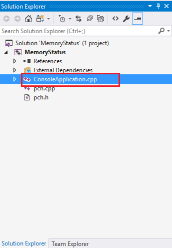
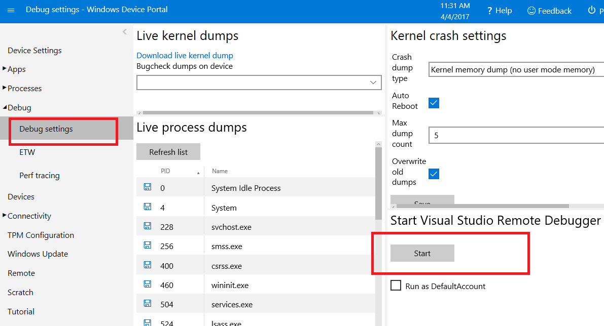
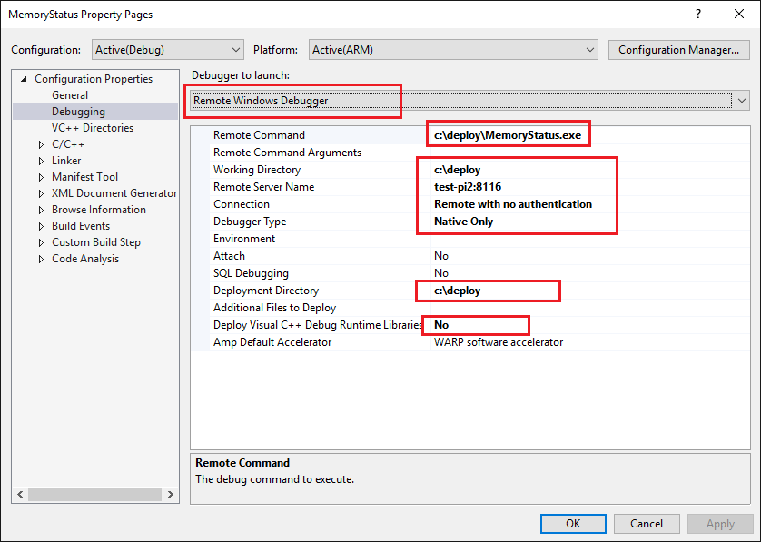
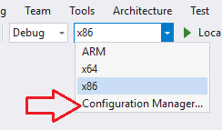
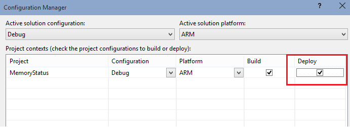
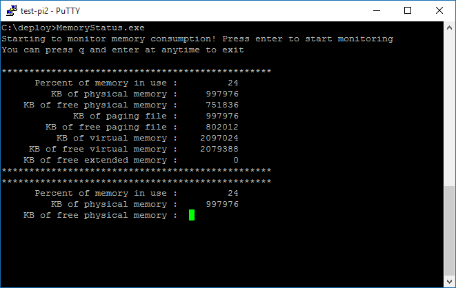
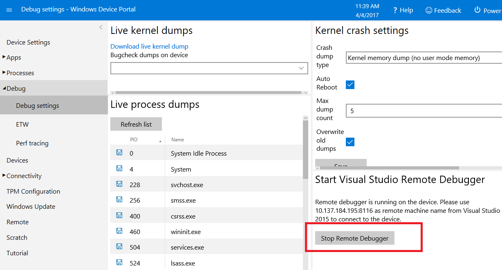

# Memory Status Monitor

This sample is intended to show how to create a console application that can be used to query the memory usage on your Windows IoT Core device (Raspberry Pi 2 or 3, Up Squared, or a DragonBoard). Please note that you need to compile the project for ARM for Raspberry Pi 2 or 3 or DragonBoard and x86 for Up Squared.

### Usage

1. Download this sample
2. Download the [Windows 10 IoT Core Project Templates for Visual Studio](https://marketplace.visualstudio.com/items?itemName=MicrosoftIoT.WindowsIoTCoreProjectTemplatesforVS15) 
3. Open the project in Visual Studio

### To create you own project
* Create a new project (File | New Project...). In the 'New Project' dialog, navigate to 'Windows IoT Core' as shown below (in the left pane in the dialog: Templates | Visual C++ | Windows | Windows IoT Core).
Select the template 'Blank Windows IoT Core Console Application'
Remember to give a good name to your first app! In this example, we called the project 'MemoryStatus'.


* Let's add some content to the console application. From Solution Explorer, select the 'ConsoleApplication.cpp' file.



* To add some functionality to our console, add the following memory status query and display code:

```C++
#include "pch.h"

#include <windows.h>
#include <chrono>
#include <thread>

using namespace std;

// Use to convert bytes to KB
#define DIV 1024

// Specify the width of the field in which to print the numbers.
#define MESSAGE_WIDTH 30
#define NUMERIC_WIDTH 10

void printMessage(LPCSTR msg, bool addColon)
{
    cout.width(MESSAGE_WIDTH);
    cout << msg ;
    if (addColon)
    {
        cout << " : ";
    }
}

void printMessageLine(LPCSTR msg)
{
    printMessage(msg, false);
    cout << endl;
}

void printMessageLine(LPCSTR msg, DWORD value)
{
    printMessage(msg, true);
    cout.width(NUMERIC_WIDTH);
    cout << right << value << endl;
}

void printMessageLine(LPCSTR msg, DWORDLONG value)
{
    printMessage(msg, true);
    cout.width(NUMERIC_WIDTH);
    cout << right << value << endl;
}

void checkInput(HANDLE exitEvent)
{
    for (;;)
    {
        char character;
        cin.get(character);
        if (character == 'q')
        {
            ::SetEvent(exitEvent);
            break;
        }
    }
}

int main(int argc, char **argv)
{
    printMessageLine("Starting to monitor memory consumption! Press enter to start monitoring");
    printMessageLine("You can press q and enter at anytime to exit");
    cin.get();
    HANDLE exitEvent = ::CreateEvent(NULL, FALSE, FALSE, NULL);
    if (NULL == exitEvent)
    {
        printMessageLine("Failed to create exitEvent.");
        return -1;
    }
    std::thread inputThread(checkInput, exitEvent);
    for (;;)
    {
        MEMORYSTATUSEX statex;
        statex.dwLength = sizeof(statex);

        BOOL success = ::GlobalMemoryStatusEx(&statex);
        if (!success)
        {
            DWORD error = GetLastError();
            printMessageLine("*************************************************");
            printMessageLine("Error getting memory information", error);
            printMessageLine("*************************************************");
        }
        else
        {
            DWORD load = statex.dwMemoryLoad;
            DWORDLONG physKb = statex.ullTotalPhys / DIV;
            DWORDLONG freePhysKb = statex.ullAvailPhys / DIV;
            DWORDLONG pageKb = statex.ullTotalPageFile / DIV;
            DWORDLONG freePageKb = statex.ullAvailPageFile / DIV;
            DWORDLONG virtualKb = statex.ullTotalVirtual / DIV;
            DWORDLONG freeVirtualKb = statex.ullAvailVirtual / DIV;
            DWORDLONG freeExtKb = statex.ullAvailExtendedVirtual / DIV;

            printMessageLine("*************************************************");

            printMessageLine("Percent of memory in use", load);
            printMessageLine("KB of physical memory", physKb);
            printMessageLine("KB of free physical memory", freePhysKb);
            printMessageLine("KB of paging file", pageKb);
            printMessageLine("KB of free paging file", freePageKb);
            printMessageLine("KB of virtual memory", virtualKb);
            printMessageLine("KB of free virtual memory", freeVirtualKb);
            printMessageLine("KB of free extended memory", freeExtKb);

            printMessageLine("*************************************************");

        }

        if (WAIT_OBJECT_0 == ::WaitForSingleObject(exitEvent, 100))
        {
            break;
        }
    }

    inputThread.join();
    ::CloseHandle(exitEvent);
    printMessageLine("No longer monitoring memory consumption!");
}
```

* Make sure the app builds correctly invoking the Build \| Build Solution menu command.

* This application can be run in either headed or headless mode.  To better understand what headed and headless mode are and how to configure your device, follow the instructions [here](https://docs.microsoft.com/en-us/windows/iot-core/learn-about-hardware/HeadlessMode)

* It is easy to deploy this console application to our Windows IoT Core device. In the [PowerShell](https://docs.microsoft.com/en-us/windows/iot-core/connect-your-device/powershell) documentation, you can find instructions to use `setcomputername` to configure a unique name for your Windows IoT Core device. In this sample, we'll use that name (though you can use your IP address as well) in the 'Remote Machine Debugging' settings in VS.

* You will first need to setup the Remote Debugger on your Windows IoT Core device. First follow the steps [here](https://docs.microsoft.com/en-us/windows/iot-core/develop-your-app/AppDeployment) to deploy any other Universal Windows Application on your device (try the HelloWorld project). This will copy all the required binaries to your device. 

* To start remote debugger on your device, open a Web Browser on your PC and point it to `http://<device name/IP address>:8080` to launch [Windows Device Portal](https://docs.microsoft.com/en-us/windows/iot-core/manage-your-device/DevicePortal). In the credentials dialog, use the default username and password: `Administrator`, `p@ssw0rd`. Windows Device Management should launch and display the web management home screen.

* Now navigate to the Debug settings section of Windows Device Portal and click the Start button under Start Visual Studio Remote Debugger. 



* This will show pop-up a message box and give you the connection information. 

*  In Visual Studio, you can configure your target by editing your project's properties (be sure to make all of the highlighted changes as appropriate to your board's name or IP address):



**Note: You can use the IP address instead of the Windows IoT Core device name.**

* The project configuration needs to be modified to enable deployment.  To do this, open the Configuration Manager by selecting the Configuration manger from the Solution Configuration drop-down menu on the toolbar.



From the Configuration Manager, ensure that the Deploy checkbox is selected for your project configuration (if this options is disabled, it is likely that the deployment options have not been fully entered into the Debugging tab of the project properties).



* Now we're ready to deploy to the remote Windows IoT Core device. Simply press F5 (or select Debug \| Start Debugging) to start debugging our app. You can also use Build \| Deploy Solution to simply deploy your application without starting a debug session.

**Note: When run from Visual Studio, the output will not display anywhere, but you will be able to set breakpoints, see variable values, etc.**

* To stop the app, press on the 'Stop Debugging' button (or select Debug \| Stop Debugging).

* Congratulations! You just deployed your first console application to a device running Windows IoT Core!

* You can now run the application as you would any other application.  Simply open a PowerShell/SSH connection (instructions can be found [here for powershell](https://docs.microsoft.com/en-us/windows/iot-core/connect-your-device/powershell) and [here for SSH](https://docs.microsoft.com/en-us/windows/iot-core/connect-your-device/SSH) and enter the Remote Command you specified above.



* Once you are done debugging Console Applications, remember to stop the remote debugger on the Windows IoT Core device. You can do this by navigating to Debug settings section of Windows Device Portal and clicking on the Stop Remote Debugger button.



## Additional resources
* [Windows 10 IoT Core home page](https://developer.microsoft.com/en-us/windows/iot/)
* [Documentation for all samples](https://developer.microsoft.com/en-us/windows/iot/samples)

This project has adopted the Microsoft Open Source Code of Conduct. For more information see the Code of Conduct FAQ or contact opencode@microsoft.com with any additional questions or comments.
